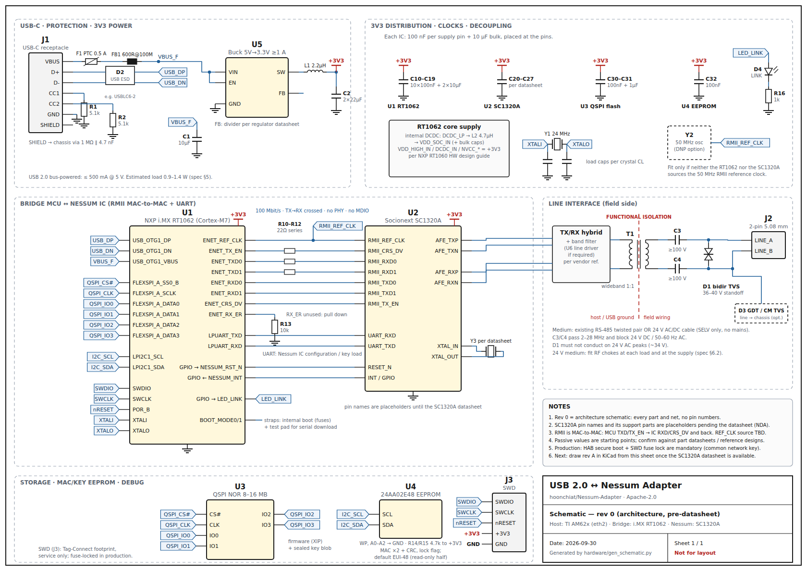

# USB 2.0 ↔ Nessum Adapter

A small USB 2.0 High-Speed dongle that gives a **TI AM62x** (Cortex-A53) Linux system a
**Nessum** (IEEE 1901 wavelet-OFDM, formerly *HD-PLC*) wired link over existing field
wiring: an **RS-485 twisted pair** or a **low-power 24 V AC/DC cable**.

To Linux it is a **standard Ethernet port, `eth2`**. It enumerates as a USB CDC-NCM
device, the stock `cdc_ncm` driver binds to it, and it appears as an ordinary Ethernet
interface with a MAC, MTU 1500, carrier and VLAN support. Existing networking software
works unchanged, and no custom kernel driver is needed.

Each unit's **Ethernet MAC (from the address block of its production run) and the
common Nessum network key are programmed at the factory and then locked**. After that neither can be changed over USB,
and the key can never be read back.

```sh
# Factory station: once per adapter; each production run has its own MAC block and quantity
factory_program.py --run R2026-10 --block 00:50:c2:aa:00:00-00:50:c2:aa:01:ff --quantity 500 \
    --key-file nessum-common.key --log production-log.csv

# In the field (read-only once locked)
nessumctl mac get        # active MAC, locked=yes
nessumctl key status     # key set, fingerprint only
nessumctl status         # Nessum link state and rate
```

For the production line there is a browser UI with big PASS/FAIL, run progress and a
unit list. It runs locally on the station PC and uses the same programming code:

```sh
host/tools/factory_ui.py --key-file nessum-common.key --log production-log.csv
# open http://127.0.0.1:8080
```


The tools need only Python 3 (`install -m 0755 host/tools/nessumctl.py /usr/local/bin/nessumctl`).
See [`docs/MANAGEMENT.md`](docs/MANAGEMENT.md).

> **Status:** Requirements, architecture, host-side integration and tools. The host
> tools are tested against a protocol simulator. There is no schematic or adapter
> firmware yet. The Nessum IC is selected (Socionext SC1320A), pending a price quote.
> Open questions are in [`docs/SPECIFICATION.md` §9](docs/SPECIFICATION.md#9-open-questions).

## At a glance

| | |
|---|---|
| **Host** | TI AM62x, TI Processor SDK Linux. In-kernel `cdc_ncm` / `cdc_acm` + DWC3/AM62 USB host |
| **Host interface** | USB 2.0 High-Speed (480 Mbit/s) device, USB-C or USB-A plug |
| **Host view** | `eth2` (alt. name `nessum0`) + management console `/dev/nessum-mgmt` |
| **MAC address** | Factory-programmed from the block defined for each production run, then locked. Duplicate-free allocation with an append-only log. |
| **Network key** | One common key, factory-programmed, locked, write-only. Sealed with the MCU's chip-unique key. |
| **Bridge MCU** | NXP i.MX RT1062 (Cortex-M7, on-chip USB HS PHY + 10/100 ENET with RMII, DCP crypto, HAB secure boot) |
| **Nessum IC** | **Socionext SC1320A** (HD-PLC4, single 3.3 V, ~0.2 W, 7×7 QFN). Fallback: MegaChips MLKHN1501AM. See [spec §4.1](docs/SPECIFICATION.md#41-nessum-ic-selection). |
| **MCU ↔ Nessum** | RMII MAC-to-MAC (no PHY), 100 Mbit/s; UART for Nessum configuration |
| **Line side** | Existing RS-485 twisted pair **or** 24 V AC/DC cable. Coupling transformer + DC-blocking caps + TVS, 2-pin terminal block. SELV only, no mains. |
| **Power** | USB bus-powered, ~0.9–1.4 W estimated (budget 2.5 W) |

## Schematic

[`hardware/schematic.svg`](hardware/schematic.svg) is the rev 0 (architecture-level) schematic:
every part and net, with signal names but no pin numbers yet. The SC1320A pin names are
placeholders until the datasheet is available. It is generated by
[`hardware/gen_schematic.py`](hardware/gen_schematic.py).

[](hardware/schematic.svg)

## Block diagram

```
 ┌──────────── Linux host (TI AM62x) ──────────────────┐
 │  cdc_ncm ──► eth2   (eth0/eth1 = CPSW)              │
 │  cdc_acm ──► /dev/nessum-mgmt ◄── nessumctl         │
 └──────────────────────┬──────────────────────────────┘
                        │ USB 2.0 HS
 ┌──────────────────────▼──────────────────────────────┐
 │  Bridge MCU (i.MX RT1062)                           │
 │   USB HS device ─ CDC-NCM ◄─► frame FIFO ◄─► ENET   │
 │   CDC-ACM mgmt ─ MAC / key / lock ─ sealed storage  │
 └───────────┬───────────────────────────┬─────────────┘
       RMII  │ 50 MHz ref clk        UART │  RESET / GPIO
 ┌───────────▼───────────────────────────▼─────────────┐
 │  Nessum IC: Socionext SC1320A                       │
 └───────────────────────┬─────────────────────────────┘
                         │ coupling xfmr + DC-block caps + TVS
                    ═════╧═════  RS-485 twisted pair  |  24 V AC/DC cable
```

## Layout

| Path | Contents |
|---|---|
| [`docs/SPECIFICATION.md`](docs/SPECIFICATION.md) | Requirements, architecture, IC selection, line interface, USB definition, open questions, plan |
| [`docs/MANAGEMENT.md`](docs/MANAGEMENT.md) | MAC and network-key handling, factory lock, factory programming, console protocol, "standard Ethernet" obligations |
| [`hardware/schematic.svg`](hardware/schematic.svg) | Rev 0 schematic (generated by `hardware/gen_schematic.py`) |
| [`hardware/bom.csv`](hardware/bom.csv) | Preliminary bill of materials, same reference designators as the schematic |
| [`firmware/README.md`](firmware/README.md) | Bridge-MCU firmware plan (USB, NCM ↔ ENET datapath, management, key sealing, secure boot) |
| [`host/linux/`](host/linux/) | AM62x kernel config fragment, `.link` naming (`eth2`), udev rule, systemd-networkd config, bring-up check |
| [`host/tools/`](host/tools/) | `nessumctl.py`, `factory_program.py`, `factory_ui.py` + `factory_ui.html` (production UI), `fake_adapter.py` protocol simulator, tests |

## Tests

```sh
cd host/tools && python3 -m unittest -v
```

## License

Licensed under the [Apache License, Version 2.0](LICENSE).
