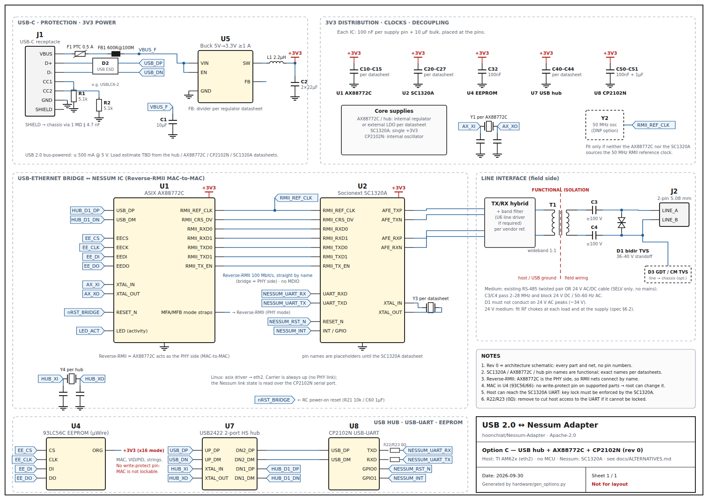

# USB 2.0 ↔ Nessum Adapter

A small USB 2.0 High-Speed dongle that gives a **TI AM62x** (Cortex-A53) Linux system a
**Nessum** (IEEE 1901 wavelet-OFDM, formerly *HD-PLC*) wired link over existing field
wiring: an **RS-485 twisted pair** or a **low-power 24 V AC/DC cable**.

**Selected design: option C.** One USB plug, one on-board USB hub, and two standard
bridge chips, with **no microcontroller and no firmware**:

- **ASIX AX88772C** (USB ↔ Ethernet, Reverse-RMII MAC-to-MAC to the Nessum IC).
  Linux's in-kernel `asix` driver makes it a **standard Ethernet port, `eth2`**.
  Existing networking software works unchanged.
- **Silicon Labs CP2102N** (USB ↔ UART to the Nessum IC). The in-kernel `cp210x`
  driver gives `/dev/nessum-mgmt` for link status and for factory programming of the
  network key.

Each unit's **MAC (from the address block of its production run) and the common Nessum
network key are programmed at the factory**. Two trade-offs of option C are accepted and
recorded in the [spec §2](docs/SPECIFICATION.md#2-assumptions--clarifications):

- **MAC:** it lives in the AX88772C's EEPROM and **cannot be hardware-locked**, so root on
  the host can change it.
- **Key lock:** keeping the network key unreadable and unchangeable must be done by the
  **SC1320A itself**. Confirming that with Socionext is the go/no-go for option C. If it
  can't, the fallback is option A, the microcontroller design, which is kept in this repo.

> **Status:** Requirements, architecture, rev 0 schematics for options A/B/C, host
> integration, and factory tooling with the option C backend. There is no rev A
> schematic yet. Still pending: the SC1320A key/lock commands (S4) and confirmation of
> the AX88772C EEPROM layout. Open questions are in
> [`docs/SPECIFICATION.md` §9](docs/SPECIFICATION.md#9-open-questions).

## At a glance

| | |
|---|---|
| **Host** | TI AM62x, TI Processor SDK Linux. In-kernel `asix` + `cp210x` + DWC3/AM62 USB host |
| **Host interface** | USB 2.0 High-Speed, USB-C or USB-A plug; on-board USB2422 2-port hub |
| **Host view** | `eth2` (asix) + `/dev/nessum-mgmt` (cp210x → SC1320A UART) |
| **Link state** | Carrier always up in Linux (Reverse-RMII has no PHY link); the real Nessum state is read over `/dev/nessum-mgmt` |
| **MAC address** | Factory-programmed per production run into the AX88772C EEPROM (duplicate-free allocation, append-only log); not hardware-lockable |
| **Network key** | One common key, factory-programmed into the SC1320A over the CP2102N; lock must be provided by the SC1320A |
| **Nessum IC** | **Socionext SC1320A** (HD-PLC4, single 3.3 V, ~0.2 W, 7×7 QFN). See [spec §4.1](docs/SPECIFICATION.md#41-nessum-ic-selection). |
| **Line side** | Existing RS-485 twisted pair **or** 24 V AC/DC cable. Coupling transformer + DC-blocking caps + TVS, 2-pin terminal block. SELV only, no mains. |
| **Power** | USB bus-powered (budget 2.5 W; estimate TBD from datasheets) |

## Block diagram

```
 ┌──────────── Linux host (TI AM62x) ──────────────────┐
 │  asix    ──► eth2   (eth0/eth1 = CPSW)              │
 │  cp210x  ──► /dev/nessum-mgmt                       │
 └──────────────────────┬──────────────────────────────┘
                        │ USB 2.0 HS
 ┌──────────────────────▼──────────────────────────────┐
 │  USB2422 2-port hub                                 │
 │     port 1 ─► AX88772C       port 2 ─► CP2102N      │
 └───────────┬───────────────────────────┬─────────────┘
 Reverse-RMII│ (MAC-to-MAC)          UART │  RESET / INT (CP2102N GPIO)
 ┌───────────▼───────────────────────────▼─────────────┐
 │  Nessum IC: Socionext SC1320A                       │
 └───────────────────────┬─────────────────────────────┘
                         │ coupling xfmr + DC-block caps + TVS
                    ═════╧═════  RS-485 twisted pair  |  24 V AC/DC cable
```

## Schematic

[`hardware/options/schematic-option-c.svg`](hardware/options/schematic-option-c.svg) is the
rev 0 (architecture-level) schematic of the selected design: every part and net, with
signal names but no pin numbers yet. Pin names are functional until the datasheets are
in hand. It is generated by [`hardware/gen_options.py`](hardware/gen_options.py).

[](hardware/options/schematic-option-c.svg)

[`docs/ALTERNATIVES.md`](docs/ALTERNATIVES.md) compares option C with option A (RT1062
microcontroller, the fallback: [schematic](hardware/schematic.svg)) and option B
(AX88772C only, key loaded by a factory fixture).

## Factory programming

Production is organised in runs, each with its own MAC block and unit quantity. The run
logic (duplicate-free MAC allocation, reserve-before-write log, overlap and common-key
checks) and the browser UI for the line are done and tested:

```sh
host/tools/factory_ui.py --key-file nessum-common.key --log production-log.csv
# open http://127.0.0.1:8080
```


The **option C backend** ([`host/tools/optionc.py`](host/tools/optionc.py), the default)
finds each unit by USB topology, writes the MAC into the AX88772C EEPROM and reads it
back, and verifies it in hardware after the operator re-plugs the unit (RE-PLUG TO
VERIFY → **VERIFIED**). **Labels only after VERIFIED is enforced:** the station never
reveals a MAC before verification, and won't program another unit while one is waiting. Still pending before production: the SC1320A key/lock
commands (spec S4), and confirming the AX88772C EEPROM layout. Until the layout is
confirmed the tools only run with `--engineering`. See
[`docs/ALTERNATIVES.md` §4](docs/ALTERNATIVES.md#4-factory-programming-changes-b-and-c).

## Layout

| Path | Contents |
|---|---|
| [`docs/SPECIFICATION.md`](docs/SPECIFICATION.md) | Requirements, architecture (option C), IC selection, line interface, USB definition, open questions, plan |
| [`docs/ALTERNATIVES.md`](docs/ALTERNATIVES.md) | Options A / B / C compared: drivers, link state, key and MAC lock, factory flow, Socionext decision questions |
| [`hardware/options/`](hardware/options/) | **Option C** (selected) and option B schematics (`gen_options.py`) and BOMs |
| [`hardware/schematic.svg`](hardware/schematic.svg), [`hardware/bom.csv`](hardware/bom.csv) | Option A (fallback) schematic (`gen_schematic.py`) and BOM |
| [`host/linux/options-bc/`](host/linux/options-bc/) | **Option C** host files: `asix`/`cp210x` kernel config, udev naming (`eth2`, `/dev/nessum-mgmt`) |
| [`host/linux/`](host/linux/) | networkd config for `eth2`, bring-up check; option A kernel/udev/`.link` files |
| [`host/tools/`](host/tools/) | `factory_program.py` + `factory_ui.py`/`.html` (runs, log, UI), `optionc.py` (option C backend), `fake_optionc.py` / `fake_adapter.py` (simulators), `nessumctl.py` (option A), tests |
| [`docs/MANAGEMENT.md`](docs/MANAGEMENT.md), [`firmware/README.md`](firmware/README.md) | Option A only: MCU console protocol, MAC/key lock, firmware plan |

## Tests

```sh
cd host/tools && python3 -m unittest -v
```

## License

Licensed under the [Apache License, Version 2.0](LICENSE).
