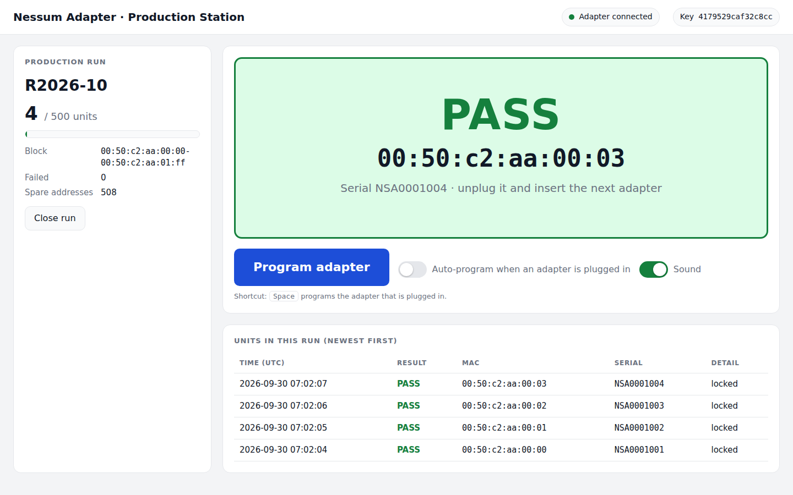
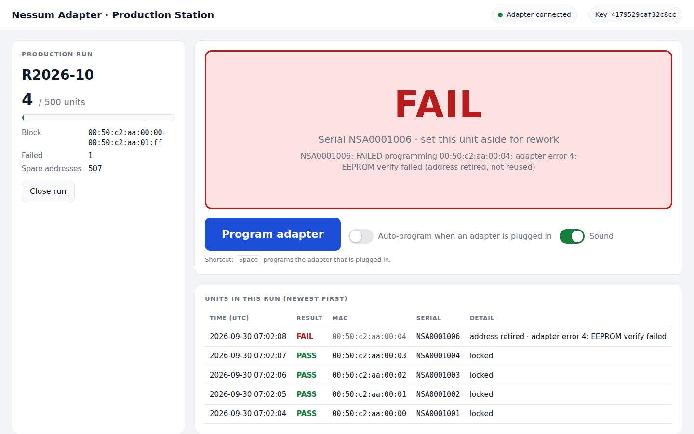

# Adapter management: MAC address, network key, factory programming & console protocol

> **Option A (fallback) only.** This document describes the RT1062 microcontroller
> design: its console protocol, and the MCU-enforced MAC and key lock. The **selected
> option C** has no microcontroller. Its MAC, key and factory flow are in
> [ALTERNATIVES.md §3–4](ALTERNATIVES.md#3-security-with-one-common-network-key). The
> production *run* rules (§3: blocks, quantities, reserve-before-write log, common-key
> check) apply to option C unchanged.

**Status:** Draft v0.3. The host tools in [`../host/tools/`](../host/tools/) implement this
document: `nessumctl.py`, `factory_program.py`, and the reference simulator
`fake_adapter.py`. The adapter firmware must match it.

---

## 1. MAC addresses in the adapter

The adapter is a transparent layer-2 bridge between USB and the Nessum line. Linux
creates an Ethernet interface for it (`eth2`), and that interface's MAC address is the
one other nodes on the Nessum network see.

**Policy (decided):** every unit is **programmed at the factory with a MAC from your own
address block and a Nessum network key (§2), and then locked**. After that neither can be
changed over USB, persistently or at runtime.

| Address | Where it lives | Used for |
|---|---|---|
| **Programmed address** | Writable lower half of the 24AA02E48 EEPROM: address + CRC-16, two copies, plus the lock flag | **Your address from your block**, written by `factory_program.py`. Survives power cycles and firmware updates, because it is not stored in firmware flash. |
| **Default address** | Read-only EUI-48 in the EEPROM's write-protected upper half (Microchip-assigned) | Only used by a unit that has not been through factory programming yet (e.g. at board test), so it is never on the network with an invalid MAC. |
| **Runtime address** | RAM only | `ip link set … address …` (NCM `SET_NET_ADDRESS`). **Refused once the unit is locked.** Only available on unlocked engineering units. |

**Active address** = the runtime address (unlocked units only), otherwise the programmed
address if valid, otherwise the default address.

The adapter reports the active address to Linux in the CDC-NCM `iMACAddress` string. The
`cdc_ncm` driver uses it as the interface's MAC, and that address appears on the wire.

**Nessum IC node address:** the SC1320A has its own MAC for Nessum-level management
(pairing, routing). It is kept **separate** from the Ethernet address above, so the IC's
bridge table never sees the same address on both sides. How it is assigned (IC factory
value or derived) is TBD from the SC1320A datasheet.

### 1.1 Validation rules (enforced by the adapter and by the host tools)

Rejected:
- **Multicast/group addresses**: bit 0 of the first octet is set (e.g. `01:…`, `33:…`).
- **All-zero**: `00:00:00:00:00:00`.
- **Broadcast**: `ff:ff:ff:ff:ff:ff`.

Allowed:
- **Locally administered** addresses (bit 1 of the first octet set, e.g. `02:…`), with a
  warning.

### 1.2 Factory lock

- `LOCK` sets the factory-lock flag. It is accepted only once **both** a programmed MAC
  and a network key exist (error 7 otherwise).
- Once locked, the adapter rejects:
  - `MAC SET`, `MAC CLEAR` and `NKEY SET` (error 6);
  - NCM `SET_NET_ADDRESS` (control-request STALL), so `ip link set eth2 address …` fails
    with an error instead of silently changing the wire address;
  - any `NESSUM` pass-through command not on a **read-only allowlist** (status,
    statistics, version, peers; the exact list comes from the SC1320A command set).
    Without this, the IC's own commands could be used to change or read the key and
    get around the lock.
- **There is no unlock command over USB.** Unlocking (RMA or rework) is done with a debug
  probe on the SWD header, running a service routine that clears the flag **and erases
  the network key**. This keeps the host OS, and anything running on it, from altering a
  shipped unit's address or key. An RMA'd unit goes back through factory programming.

### 1.3 Applying a new address

The Linux driver reads `iMACAddress` only when the device enumerates. After a MAC is
programmed, `REBOOT` disconnects and reconnects the adapter from USB. The interface
disappears for about a second, then returns with the new address. The `.link` file
matches on USB VID:PID and not on MAC, so the interface keeps the name `eth2`.

---

## 2. Nessum network key

Nodes on a Nessum network encrypt traffic with a shared network key. Only nodes holding
the same key can talk to each other. The key is **programmed at the factory** and then
locked (§1.2), so units ship ready to talk to each other with no pairing in the field.

**Key size:** 16 bytes (AES-128) is assumed throughout the tools (`NKEY_LEN`). Confirm it
against the SC1320A security documentation.

**Write-only.** Nothing on USB can read the key back. `NKEY GET` returns only whether a
key is set and its **fingerprint**: the first 16 hex digits of SHA-256(key). The factory
script uses the fingerprint to verify the write, and the CSV log records only the
fingerprint.

**Storage on the adapter.** The key is not stored in the clear in the I²C EEPROM, where
anyone with a probe could read it. The RT1062 firmware seals it with the MCU's **DCP
crypto engine, using the chip-unique OTP key**, and stores only the sealed blob in QSPI
flash. At every boot the firmware unseals the key and loads it into the SC1320A over the
internal UART. A blob copied to another board cannot be unsealed. (If the SC1320A turns
out to have its own protected key storage, store it there instead. TBD from the datasheet.)
Residual exposure: the key crosses the on-board UART at boot, so an attacker with the unit
open and a logic analyser could capture it. That is acceptable for this threat model,
and noted.

**Key scope (decided): one common key for all units.** Every adapter ever built gets the
same key, so any unit can talk to any other with no per-site setup and no matched sets
to ship.

What that choice means, and how the design compensates:

| Consequence | Mitigation |
|---|---|
| Anyone who extracts the key from **one** unit can decrypt and join **every** installation's Nessum network (with physical access to that wiring) | The key is never readable over USB. It is sealed with each MCU's chip-unique key, so copying the flash is useless. HAB secure boot, signed firmware and a fused-off/locked SWD port are **mandatory** in production (see `firmware/README.md`, Security). |
| Any genuine adapter can join any site's network | Acceptable for field wiring that is physically private (RS-485 pair, 24 V cable). If a site needs isolation later, that requires a per-site key, i.e. an RMA reprogram. |
| The key cannot be rotated in the field (units are locked) | Changing the common key means new units cannot talk to old ones. `factory_program.py` refuses a different key unless `--new-key` is given, so this can only happen deliberately. |
| The key file at the factory is the crown jewel | Keep it in a secrets store and copy it to the programming station only for the run (mode 600, deleted afterwards). Never commit it: `*.key` is in `.gitignore`. |

Generating the common key (once, ever):

```sh
(umask 077; python3 -c 'import secrets; print(secrets.token_hex(16))' > nessum-common.key)
```

---

## 3. Factory programming

[`../host/tools/factory_program.py`](../host/tools/factory_program.py) runs on the
programming station, which can be the AM62x board itself or any Linux PC. Production is
organised in **runs**. For each run you define an ID, the MAC address block for that run,
and the number of units. Then run the script once per adapter:

```sh
factory_program.py --run R2026-10 \
    --block 00:50:c2:aa:00:00-00:50:c2:aa:01:ff --quantity 500 \
    --key-file nessum-common.key --log production-log.csv
# NSA0001234: 00:50:c2:aa:00:00, key 4179529caf32c8cc, programmed + locked - run R2026-10 unit 1/500
```

`--block` is `first-last` or `base/prefixlen`. Make it **somewhat larger than
`--quantity`** so addresses retired by failed units don't stop the run.

For each unit the script:

1. Checks the run against the log (details below) and stops with
   "run … is complete" once `--quantity` units have been programmed.
2. Reads the unit's serial number (`VERSION`) and current state (`MAC GET`). It refuses
   units that are **already locked**, and units already programmed (unless `--force`).
3. Picks the next free address in the run's block: one above the highest address ever
   recorded in the log.
4. **Writes a `reserved` row to the log and fsyncs it before touching the adapter.** A
   crash, unplug or power loss mid-way can therefore never lead to an address being
   handed out twice. An address whose programming fails is logged as `failed` and
   **retired, not reused**.
5. `MAC SET` → reads back and verifies → `NKEY SET` → checks the key fingerprint →
   `LOCK` → checks the lock → `REBOOT`.
6. Logs `locked` with the run ID, serial number and key fingerprint. The CSV is your
   traceability record (run ↔ serial ↔ MAC ↔ key fingerprint). It never contains the key.

**Run checks** (from the log):

| Check | Why |
|---|---|
| The first unit of a run records its block and quantity (`run-open` row). Later calls with a different block or quantity are refused. | Catches a typo halfway through a run |
| A run's block must not overlap another run's block or any address another run used | No duplicate MACs across runs |
| The block must hold at least `--quantity` addresses | Fails before the first unit, not the 400th |
| The key fingerprint must match earlier units (unless `--new-key`) | One common key: a wrong key file would ship units that cannot talk to the rest |

**Keep one log for all runs** and back it up: the overlap and key checks only see what is
in that log. If a run is split across several programming stations, give each station its
own sub-run (e.g. `R2026-10a`, `R2026-10b`) with a disjoint sub-block, then merge the logs
into the master log afterwards.

`--no-lock` is for engineering units only.

### 3.1 Production UI

For the line, [`../host/tools/factory_ui.py`](../host/tools/factory_ui.py) wraps the same
code in a browser page. Start it on the station PC and open `http://127.0.0.1:8080`:

```sh
factory_ui.py --key-file nessum-common.key --log production-log.csv
```

- **Run panel:** start a run (ID, MAC block, quantity) or resume one listed from the log.
  It shows progress, failed units and spare addresses (in red when failures have eaten
  into the spare margin). All run checks are applied when the run is started.
- **Result tile:** a large **PASS** (with the MAC to write on the label), **FAIL** (set
  the unit aside; its address is retired and is *not* shown, so it can't end up on a
  label), **ALREADY PROGRAMMED**, or **RUN COMPLETE**. It also plays a pass/fail sound.
- **Program button** (or **Space**), or **auto mode**: each newly plugged-in adapter is
  programmed once. Units are recognised by serial number, so an adapter re-enumerating
  after its own REBOOT is not programmed twice.
- **Unit list:** newest first, with time, result, MAC, serial and detail.

Security: the server listens on 127.0.0.1 only, rejects requests from other web pages
(CSRF) and foreign Host headers (DNS rebinding), and never sends the key to the browser.
The page only shows the fingerprint.




The programming station is trusted: the key crosses USB in the clear once per unit, at the
factory.

---

## 4. Console protocol

Transport: the adapter's CDC-ACM interface (`/dev/ttyACM*`, symlinked to
`/dev/nessum-mgmt` by the udev rule). The baud rate is ignored. The host opens the tty
in raw mode. The adapter **does not echo**.

- **Request:** one ASCII line, `COMMAND [ARGS…]`, terminated by `\n` (a `\r` before it is
  ignored). Commands are case-insensitive. Arguments are separated by single spaces.
  Maximum 255 bytes.
- **Response:** zero or more data lines of the form `KEY=VALUE [KEY=VALUE…]`, then exactly
  one terminal line: `OK` or `ERR <code> <message>`. Each line ends with `\r\n`.
- One request at a time: the host waits for the terminal line before sending the next.
- MAC addresses are written as lowercase `xx:xx:xx:xx:xx:xx`. The adapter also accepts
  `-` separators and bare 12-hex-digit input.

### 4.1 Commands

| Command | Response data | Notes |
|---|---|---|
| `VERSION` | `fw=<semver> hw=<rev> serial=<usb iSerial> nessum=<ic fw ver> proto=1` | |
| `STATUS` | `link=up\|down rate=<PHY Mbit/s> peers=<n>` | `rate` is also reported to Linux (§5) |
| `MAC GET` | `active=<mac> source=runtime\|programmed\|default default=<mac> programmed=<mac>\|none locked=yes\|no` | |
| `MAC SET <mac>` | `programmed=<mac> apply=reboot` | Validates (§1.1), then writes both EEPROM copies and verifies them. Does **not** change `active` until reboot. Error 6 if locked. |
| `MAC CLEAR` | `programmed=none apply=reboot` | Reverts to the default address. Error 6 if locked. |
| `NKEY SET <hex>` | `fp=<fingerprint>` | Network key, exactly `NKEY_LEN` bytes, not all-zero (error 8). Sealed and stored (§2). Error 6 if locked. |
| `NKEY GET` | `set=yes\|no fp=<fingerprint>\|none len=<bytes>` | **Never** returns the key |
| `LOCK` | `locked=yes` | Factory lock, one-way over USB (§1.2). Error 7 unless both the MAC and the key are programmed. |
| `REBOOT` | — | Sends `OK`, then disconnects from USB within 100 ms and re-enumerates |
| `NESSUM <text>` | `reply=<text>` (one line per IC reply line) | Pass-through to the Nessum IC's UART command interface. Read-only allowlist after `LOCK` (error 6). |

### 4.2 Error codes

| Code | Meaning |
|---|---|
| `1` | Unknown command |
| `2` | Bad argument (syntax) |
| `3` | Invalid MAC (multicast, zero or broadcast) |
| `4` | Storage write or verify failed |
| `5` | Nessum IC not responding |
| `6` | Adapter is factory-locked |
| `7` | Cannot lock: MAC and network key must both be programmed |
| `8` | Invalid network key (wrong length or all-zero) |

### 4.3 Example session (what `factory_program.py` does)

```
> VERSION
< fw=1.0.0 hw=A serial=NSA0001234 nessum=x.y proto=1
< OK
> MAC GET
< active=00:1e:c0:12:34:56 source=default default=00:1e:c0:12:34:56 programmed=none locked=no
< OK
> MAC SET 00:50:c2:aa:00:2a
< programmed=00:50:c2:aa:00:2a apply=reboot
< OK
> MAC GET
< active=00:1e:c0:12:34:56 source=default default=00:1e:c0:12:34:56 programmed=00:50:c2:aa:00:2a locked=no
< OK
> NKEY SET 0f1e2d3c4b5a69788796a5b4c3d2e1f0
< fp=4179529caf32c8cc
< OK
> NKEY GET
< set=yes fp=4179529caf32c8cc len=16
< OK
> LOCK
< locked=yes
< OK
> REBOOT
< OK
   (adapter re-enumerates; eth2 on the host now has 00:50:c2:aa:00:2a)
```

---

## 5. What makes it look like a standard Ethernet port to Linux

Firmware obligations, so that existing software (sockets, DHCP clients, bridges, VLANs,
`ip`, `ethtool -i`, NetworkManager, systemd-networkd) works unchanged:

| Behaviour | How |
|---|---|
| ARPHRD_ETHER netdev with a normal MAC, named `eth2` | CDC-NCM class, `cdc_ncm` driver. The `.link` file names it `eth2`, next after the AM62x CPSW's `eth0`/`eth1`. |
| MTU 1500, VLAN-tagged frames | `wMaxSegmentSize` = **1518** (1514 + 802.1Q tag). Check this against the SC1320A's maximum frame size. |
| `ip link set address` | NCM `SET_NET_ADDRESS` / `GET_NET_ADDRESS` implemented; `SET` is refused on locked units (§1.2) |
| Promiscuous / multicast (bridging, IPv6, mDNS) | Implement `SET_ETHERNET_PACKET_FILTER`. The adapter forwards everything by default. |
| Carrier (`ip link` `LOWER_UP`, `ethtool` link detected) | `NETWORK_CONNECTION` notification follows the Nessum link |
| Link speed in `ethtool` | `CONNECTION_SPEED_CHANGE` notification carries the current Nessum PHY rate |

Known differences from a PHY-based NIC (none of these affect ordinary IP software):
`ethtool -i` reports driver `cdc_ncm`. There is no auto-negotiation, no MDIO/PHY registers,
no Wake-on-LAN, no PTP hardware timestamping, and no checksum/TSO offload.
